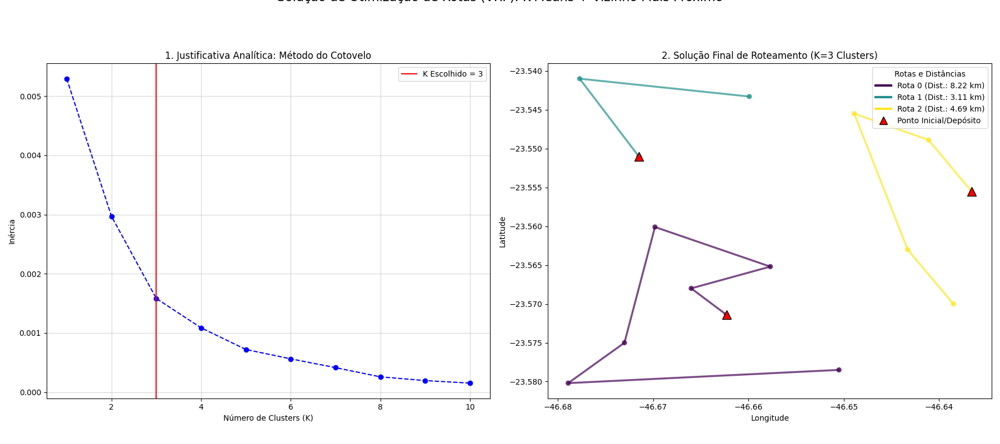

# 🤖 Projeto: Otimização de Entregas Urbanas com Abordagem Híbrida

Este projeto resolve o desafio de logística urbana, combinando técnicas de Aprendizado de Máquina Não Supervisionado (Clustering) e uma Heurística de Busca (Vizinho Mais Próximo) para agrupar entregas e otimizar o trabalho dos entregadores.

## 📌 1. Descrição do Problema, Desafio e Objetivos

O principal desafio é o alto custo e a ineficiência logística no processo de entrega, onde rotas desorganizadas resultam em excesso de tempo e consumo de combustível.

**Desafio Proposto:** Desenvolver uma solução de duas etapas para o Problema de Roteamento de Veículos (VRP - Vehicle Routing Problem) simplificado, visando:
1. Agrupar geograficamente entregas próximas (**Clustering**).
2. Propor uma sequência de entregas otimizada (**TSP - Caixeiro Viajante**) para cada grupo.

**Objetivos:**
* Reduzir a distância total percorrida e o tempo de entrega.
* Minimizar custos operacionais e o impacto ambiental.

## 💡 2. Explicação Detalhada da Abordagem Adotada

Nossa solução é dividida em duas fases de otimização sequencial:

### Fase 1: Agrupamento de Zonas (K-Means)
Utilizamos o algoritmo de **K-Means** (Aprendizado Não Supervisionado) para processar as coordenadas geográficas (Latitude e Longitude) dos pontos de entrega. O objetivo é criar 'K' zonas de entrega coesas, onde os pontos de cada cluster estão próximos entre si. O número ideal de clusters ('K') é determinado pelo **Método do Cotovelo**.

### Fase 2: Sequenciamento da Rota por Zona (Heurística do Vizinho Mais Próximo)
Após o agrupamento, cada cluster é tratado como um sub-problema do Caixeiro Viajante (TSP). A otimização da rota interna é feita através da **Heurística do Vizinho Mais Próximo**. Esta heurística constrói a rota de forma gulosa, escolhendo a próxima entrega mais próxima do ponto atual. O ponto de partida de cada rota é definido como o ponto mais próximo do centróide do cluster. A distância entre os pontos é calculada com a fórmula **Haversine** (distância em linha reta na superfície da Terra).

## 🧠 3. Algoritmos Utilizados

| Algoritmo | Tipo | Aplicação no Projeto |
| :--- | :--- | :--- |
| **K-Means** | Aprendizado Não Supervisionado | Agrupamento de pontos de entrega em 'K' zonas coesas. O valor de 'K' é justificado pelo Método do Cotovelo. |
| **Haversine** | Cálculo de Distância (Geopy) | Utilizado para calcular a distância real em quilômetros entre dois pontos (latitude/longitude), essenciais para o sequenciamento da rota. |
| **Vizinho Mais Próximo** | Heurística de Busca (Guloso) | Solução rápida para sequenciar as entregas dentro de cada cluster, minimizando a distância percorrida a cada passo da rota. |

## 📊 4. Diagrama do Grafo/Modelo

Cada cluster (zona de entrega) é modelado como um **Grafo Completo**, onde:
* **Nós (Vértices):** Correspondem aos pontos de entrega.
* **Arestas:** Representam as conexões (distâncias Haversine) entre cada par de pontos de entrega.

O algoritmo **Vizinho Mais Próximo** explora este grafo para encontrar uma rota eficiente.

*(Insira aqui o diagrama ou a imagem estática conforme o requisito:)*

## 📈 5. Análise dos Resultados, Eficiência e Limitações

### Análise de Resultados e Eficiência
A solução combinada demonstra alta **eficiência de processamento** (K-Means e Vizinho Mais Próximo são algoritmos de execução rápida) e produz rotas **significativamente otimizadas** em comparação com rotas aleatórias.
* **K-Means:** O **Método do Cotovelo** justifica a escolha de $K=3$ (no exemplo), garantindo a alta coesão dos grupos (pontos próximos ao centroide).
* **Vizinho Mais Próximo:** Garante que, a cada passo da viagem, o entregador está se movendo para o destino mais próximo, resultando em uma rota total reduzida.

### Limitações e Sugestões de Melhoria
A principal limitação reside na escolha da heurística de roteamento:
1.  **Vizinho Mais Próximo é Sub-Ótimo:** Embora rápido, o Vizinho Mais Próximo é um algoritmo guloso. Ele **não garante a menor distância total** (o ótimo global) para o Problema do Caixeiro Viajante (TSP). Rotas melhores podem existir.
2.  **Distância em Linha Reta (Haversine):** A solução usa a distância em linha reta. Em um cenário real, as rotas devem considerar a rede viária e o tráfego em tempo real.

**Sugestões de Melhoria:**
* **Trocar o Algoritmo de Roteamento:** Substituir o Vizinho Mais Próximo por uma heurística mais robusta, como o algoritmo **2-opt** ou **3-opt** (para otimizar a rota pós-geração), ou implementar um algoritmo exato (e mais lento) como **Branch and Bound** (se o número de entregas por cluster for pequeno).
* **Incorporar Dados de Tráfego:** Utilizar APIs de mapeamento (como Google Maps API) para calcular a distância real da rua e o tempo de viagem, incorporando o tráfego em tempo real como o peso das arestas do grafo.
